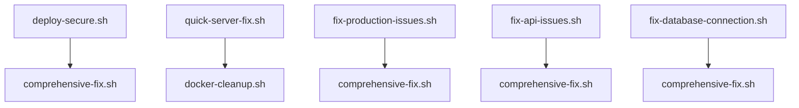

# Deployment Scripts Reference

## 📜 Available Scripts

### Core Deployment Scripts

#### `deploy-secure.sh`
**Purpose**: Complete secure deployment with fresh database
**Usage**: `./deploy-secure.sh`
**When to use**: Regular deployments, major updates

**What it does**:
- Creates backend.env from example if missing
- Stops existing containers
- Removes old postgres volume for fresh start
- Builds and starts services
- Tests database connection
- Runs migrations
- Verifies deployment success

**Output**: Success/failure status with detailed logs

#### `quick-server-fix.sh`
**Purpose**: Emergency server performance fix
**Usage**: `./quick-server-fix.sh`
**When to use**: App is slow/unresponsive, emergency situations

**What it does**:
- Checks system resources (memory, disk, CPU)
- Kills hanging Docker processes
- Performs quick Docker cleanup
- Restarts services with resource limits
- Tests service responsiveness
- Optimizes Nginx

**Output**: System status before/after, service health

#### `comprehensive-fix.sh`
**Purpose**: Complete system fix for complex issues
**Usage**: `./comprehensive-fix.sh`
**When to use**: Multiple issues, system-wide problems

**What it does**:
- Fixes database password mismatches
- Updates ALLOWED_HOSTS configuration
- Creates Docker-specific Django settings
- Fixes frontend environment variables
- Cleans Docker environment
- Rebuilds and starts services
- Tests all connections

**Output**: Detailed fix log with success/failure status

### Specialized Fix Scripts

#### `fix-production-issues.sh`
**Purpose**: Production-specific issue fixes
**Usage**: `./fix-production-issues.sh`
**When to use**: Production environment issues

#### `fix-api-issues.sh`
**Purpose**: API endpoint and connectivity fixes
**Usage**: `./fix-api-issues.sh`
**When to use**: API not responding, endpoint errors

#### `fix-database-connection.sh`
**Purpose**: Database connection and migration fixes
**Usage**: `./fix-database-connection.sh`
**When to use**: Database connectivity issues

#### `fix-deployment.sh`
**Purpose**: General deployment issue fixes
**Usage**: `./fix-deployment.sh`
**When to use**: Deployment failures, container issues

### Utility Scripts

#### `diagnose-app-status.sh`
**Purpose**: Comprehensive system diagnostics
**Usage**: `./diagnose-app-status.sh`
**When to use**: Troubleshooting, system analysis

#### `docker-cleanup.sh`
**Purpose**: Clean up Docker resources
**Usage**: `./docker-cleanup.sh`
**When to use**: Disk space issues, Docker cleanup

## 🚀 Script Selection Guide

### For Different Scenarios

| Scenario | Recommended Script | Alternative |
|----------|-------------------|-------------|
| Regular deployment | `deploy-secure.sh` | `comprehensive-fix.sh` |
| App is down | `quick-server-fix.sh` | `comprehensive-fix.sh` |
| Multiple issues | `comprehensive-fix.sh` | Individual fix scripts |
| API not working | `fix-api-issues.sh` | `comprehensive-fix.sh` |
| Database issues | `fix-database-connection.sh` | `comprehensive-fix.sh` |
| Production problems | `fix-production-issues.sh` | `comprehensive-fix.sh` |
| System diagnostics | `diagnose-app-status.sh` | Manual checks |

### Script Dependencies



## 📋 Script Execution Order

### 1. Pre-Deployment
```bash
# Check system status
./diagnose-app-status.sh

# Clean up if needed
./docker-cleanup.sh
```

### 2. Deployment
```bash
# Regular deployment
./deploy-secure.sh

# Or comprehensive fix if issues exist
./comprehensive-fix.sh
```

### 3. Post-Deployment
```bash
# Verify deployment
./diagnose-app-status.sh

# Check specific issues if any
./fix-api-issues.sh
```

## 🔧 Script Customization

### Environment Variables
Most scripts use these environment variables:
```bash
# Project directory
PROJECT_DIR="/opt/vvv-frontpage"

# Docker compose file
COMPOSE_FILE="docker-compose.yml"

# Environment files
BACKEND_ENV="env/backend.env"
FRONTEND_ENV="env/frontend.env"
```

### Customizing Scripts
1. **Add new checks**: Add validation steps in the script
2. **Modify timeouts**: Adjust sleep/wait times
3. **Add notifications**: Integrate with Slack/email alerts
4. **Custom logging**: Add detailed logging to files

## 📊 Script Monitoring

### Success Indicators
- ✅ All containers running (`docker-compose ps`)
- ✅ API responding (`curl -I https://veveve.dk/api/`)
- ✅ Database connected (no connection errors)
- ✅ No critical errors in logs

### Failure Indicators
- ❌ Containers not starting
- ❌ API returning 500 errors
- ❌ Database connection failures
- ❌ High error rates in logs

## 🆘 Troubleshooting Scripts

### Script Won't Run
```bash
# Check permissions
ls -la *.sh
chmod +x *.sh

# Check for syntax errors
bash -n script-name.sh
```

### Script Hangs
```bash
# Check running processes
ps aux | grep script-name

# Kill hanging processes
pkill -f script-name

# Check Docker status
docker-compose ps
```

### Script Fails
```bash
# Check script logs
./script-name.sh 2>&1 | tee script-output.log

# Check Docker logs
docker-compose logs --tail=100

# Check system resources
df -h
free -h
```

## 📝 Creating New Scripts

### Script Template
```bash
#!/bin/bash

echo "🔧 SCRIPT NAME"
echo "=============="
echo ""

# Colors for output
RED='\033[0;31m'
GREEN='\033[0;32m'
YELLOW='\033[1;33m'
BLUE='\033[0;34m'
NC='\033[0m' # No Color

print_status() {
    echo -e "${BLUE}[INFO]${NC} $1"
}

print_success() {
    echo -e "${GREEN}[SUCCESS]${NC} $1"
}

print_warning() {
    echo -e "${YELLOW}[WARNING]${NC} $1"
}

print_error() {
    echo -e "${RED}[ERROR]${NC} $1"
}

# Script logic here
print_status "Starting script..."

# Your code here

print_success "Script completed!"
```

### Best Practices
1. **Use colors** for output clarity
2. **Add error handling** for all commands
3. **Include status checks** before and after
4. **Log all operations** for debugging
5. **Test thoroughly** before using in production

---

*Last Updated: September 30, 2025*
*For script issues or new script requests, contact the development team.*
